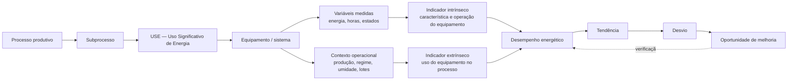

# ETAPA 1 — Entendimento e metodologia

> A ISO 50001 é usada aqui como **referencial metodológico e fonte de boas práticas**. Não há objetivo de
> certificação. Os dados exibidos na aplicação são **fictícios (DEMO/MOCK)**, gerados por simulação.

## 1.1 O problema, em uma frase

Um painel de consumo responde *quanto* de energia foi gasto. O que a gestão de energia precisa responder é
**onde**, **por quê**, **com qual desempenho** e **o que fazer a respeito** — e isso só existe quando cada
número está amarrado a uma etapa física do processo produtivo, a um equipamento e a uma condição operacional.

Por isso o princípio que organiza todo o sistema é:

> **Energia conectada ao processo.** Nenhum indicador existe solto: ele nasce de um USE, que pertence a um
> subprocesso, que compõe um processo, dentro de uma área da planta — e é lido junto com a produção e as
> condições que explicam o consumo.

## 1.2 A cadeia metodológica



Cada elo é uma entidade do banco e uma tela do sistema — a metodologia não é um texto anexo, é a própria
estrutura de dados (ver [ETAPA 3](03-arquitetura-de-dados.md)).

### Exemplo completo, de ponta a ponta (dados DEMO)

| Elo | Conteúdo |
|---|---|
| Área | Recebimento |
| Processo | Secador |
| USE | Sistema de ventilação do secador (categoria *Ventilação e exaustão*, regime contínuo 24×7 na safra) |
| Equipamento | `REC-SEC-VEN-01` — Motor ventilador 01, 75 kW, IE3, sem inversor |
| Variáveis | `…VEN-01.EAT` energia ativa (kWh, medidor 15 min) · `…HOP` horas em operação · `…HVZ` horas em vazio · `…FP` fator de potência |
| Indicador **intrínseco** | Fator de carga = `(E / H) × (η/100) / Pn × 100` — usa dados de placa do próprio equipamento |
| Contexto operacional | Grão úmido na entrada, umidade de entrada/saída, água removida, horas produtivas da etapa |
| Indicador **extrínseco** | Consumo específico = `E / P` (kWh por tonelada de grão seco); % do tempo em vazio; utilização |
| Análise temporal | Série semanal, média móvel, tendência, carta de controle I-MR, meta da janela de safra |
| Desvio | Em ago/2026 o ventilador 03 opera com fator de carga ~100% (damper travado): kWh/t 25% acima da meta |
| Oportunidade | `OP-2026-005` — inspeção do damper e avaliação de inversor; economia estimada e prazo |

## 1.3 Intrínseco × extrínseco — por que os dois são necessários

| | Indicador **intrínseco** | Indicador **extrínseco** |
|---|---|---|
| Pergunta | O equipamento está funcionando bem? | O processo está usando bem o equipamento? |
| Origem | Características de placa + medição elétrica | Medição + variáveis de produção e de operação |
| Exemplos | fator de carga, fator de potência, rendimento térmico, relação vapor/combustível, corrente, consumo em vazio | kWh/t, GJ/t, MJ/kg de água evaporada, kWh/lote, kWh/mil sacos, % de tempo em vazio, partidas/dia, utilização, consumo sem produção |
| O que revela | dimensionamento, manutenção, qualidade de energia | sequenciamento, ociosidade, setup, lógica operacional, planejamento |

O caso clássico: um motor que **precisa** rodar 24×7 tem pouca oportunidade em horas de operação — as
oportunidades estão no rendimento, no ponto de operação e na carga. Já um motor **intermitente** costuma ter a
maior oportunidade no *tempo ligado sem produto*: na base DEMO, o Debulhador 02 passou de ~7% para ~22% de tempo
em vazio a partir de jan/2026, e isso aparece como desvio crítico antes de qualquer aumento de consumo total
chamar atenção.

## 1.4 Como um USE é caracterizado

Cada USE carrega: nome, categoria, processo/subprocesso, equipamentos associados, fonte de energia, potência
instalada (soma dos equipamentos), consumo no período, período e **regime de operação** (contínuo 24×7,
intermitente, batelada, sazonal), critério de significância, responsável, variáveis relevantes (o que explica o
consumo) e seus indicadores intrínsecos e extrínsecos. A lista de categorias é cadastrável — nada está fixo no
código.

## 1.5 Regras de leitura que o sistema aplica (e por quê)

1. **Razão de somas, nunca média de razões.** O kWh/t de um mês é `Σ kWh ÷ Σ t`. A média das razões diárias dá
   outro número e superpondera dias de baixa produção. O motor de cálculo agrega primeiro, aplica a fórmula
   depois (há teste automatizado cobrindo isso).
2. **Dado ausente nunca vira zero.** Falta de leitura reduz a **completude**; abaixo do mínimo configurado o
   indicador fica *Sem dados suficientes* — com o valor ainda visível, mas sinalizado.
3. **Parado não é falta de dado.** Entressafra e equipamento desligado geram o status *Sem operação*: é
   informação de processo, não falha de medição. Indicadores que só existem com o equipamento girando (fator de
   potência, corrente) medem completude sobre os **dias de operação**.
4. **Aumento de consumo não é necessariamente piora.** Toda variação de consumo é decomposta (LMDI) em
   **efeito produção** e **efeito intensidade**. Na Safra Verão 2026 (DEMO) o grão chegou mais úmido: o vapor
   absoluto subiu, mas a energia por quilo de água evaporada caiu — melhora real de eficiência.
5. **Meta anual e meta por safra convivem.** Em operação sazonal, julgar a safrinha pela média anual gera
   falsos alarmes. Cada indicador tem metas versionadas por Crop Year (períodos longos) e por janela de safra
   (períodos curtos), com justificativa registrada.
6. **Energia secundária não é somada duas vezes.** Vapor e ar comprimido são vetores internos: entram no
   balanço da etapa que os consome, mas o total da planta conta apenas a energia que cruza a fronteira
   (eletricidade comprada e biomassa).
7. **O que não está submedido aparece.** A diferença entre o medidor do CCM e a soma das submedições é
   publicada como *consumo não alocado* — é transparência de medição e uma pauta de melhoria, não um erro
   escondido.

## 1.6 Escopo inicial da planta (configurável, não codificado)

```
Empresa → Planta → Área → Processo → Subprocesso
                      ├── Recebimento → Despalha · Debulha · Secador · Caldeira
                      └── Torre       → Limpeza · Classificação · Tratamento (Preparo de calda · Aplicação)
                                                 · Ensaque (Ensacamento · Paletização)
```

Áreas, processos, subprocessos, USEs, equipamentos, variáveis, indicadores, fórmulas, metas, Crop Years e
safras são **dados cadastrados**. Incluir uma nova área ou um novo indicador é operação de tela
(Configurações), sem tocar em código — requisito verificado por teste automatizado.

## 1.7 Papéis e participação dos donos de processo

| Perfil | O que faz no sistema |
|---|---|
| Administrador | Tudo, incluindo usuários e trilha de auditoria |
| Gestão de Energia | Cadastra hierarquia, USEs, equipamentos, variáveis, indicadores, metas e linhas de base |
| Dono do Processo | Edita o que é do seu escopo (área/processo atribuído), registra e acompanha oportunidades |
| Visualizador | Somente leitura |

O dono do processo é quem explica **como o processo usa energia**: é dele a definição das variáveis relevantes,
do regime operacional e da meta realista para cada janela de safra. A aplicação foi desenhada para que essa
conversa aconteça em cima das telas de USE, processo e indicador.

## 1.8 Próximas etapas do documento

- [ETAPA 2 — Arquitetura funcional](02-arquitetura-funcional.md)
- [ETAPA 3 — Arquitetura de dados](03-arquitetura-de-dados.md)
- [ETAPA 4 — Arquitetura tecnológica](04-arquitetura-tecnologica.md)
- [ETAPA 5 — UX/UI](05-ux-ui.md)
- [ETAPA 6 — Implementação e operação](06-implementacao.md)
- [Evoluções futuras](07-evolucoes-futuras.md)
