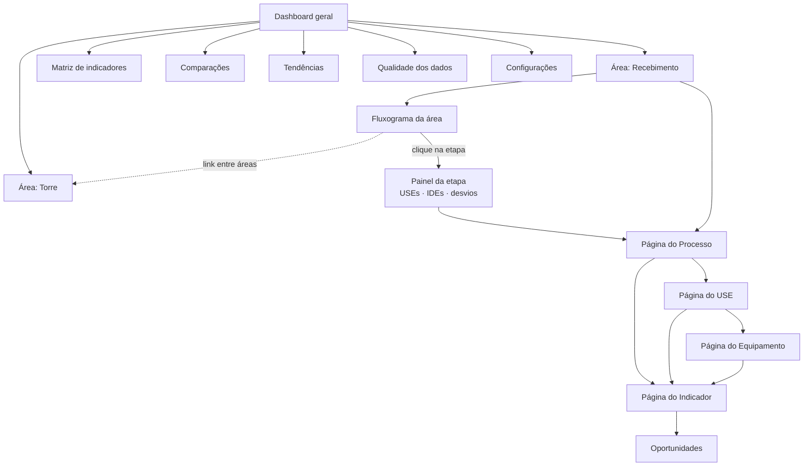

# ETAPA 2 — Arquitetura funcional

## 2.1 Módulos

| Módulo | Responsabilidade | Telas principais |
|---|---|---|
| **Estrutura da planta** | Hierarquia configurável (empresa → planta → área → processo → subprocesso), fluxogramas, responsáveis | Configurações › Hierarquia, Fluxograma |
| **USEs e ativos** | Usos significativos, equipamentos, dados de placa, variáveis/tags | USEs, USE, Equipamento, Configurações |
| **Motor de indicadores (IDEs)** | Fórmulas configuráveis, vínculos de variáveis, agregação, unidades, completude, status | Indicador, Configurações › Indicadores |
| **Metas e linhas de base** | Metas anuais e por safra, baseline fixa e por regressão (consumo esperado) | Indicador, Configurações › Linhas de base |
| **Análise temporal** | Séries, média móvel, tendência, carta de controle, comparação entre períodos | Indicador, Tendências, Comparações |
| **Consolidação de energia** | Totais por nó, fonte, USE, categoria; Sankey; não alocado; intensidade | Dashboard, Área, Processo |
| **Diagnóstico** | Desvios, deteriorações, contexto de produção, qualidade de dado | Dashboard, Área, Processo, Comparações |
| **Oportunidades** | Registro ligado ao desvio, economia estimada, prazo, responsável, status | Oportunidades |
| **Qualidade de dados** | Completude, origem, frequência, automático/manual, leituras suspeitas | Qualidade dos dados, Indicador |
| **Ingestão e integração** | CSV, API de integração (gateway OPC UA/MQTT), lotes e rejeições | Configurações › Ingestão |
| **Segurança** | Autenticação, perfis, escopo por nó, trilha de auditoria | Login, Configurações › Auditoria |

## 2.2 Mapa de navegação

Hierarquia de drill-down: **Empresa → Área → Processo → Subprocesso → USE → Equipamento → Indicador → Histórico
→ Análise de tendência**, com retorno por breadcrumb em qualquer nível.

## 2.3 Filtros globais e preservação de contexto

A barra superior escopa **tudo** que está abaixo dela:

- **Período**: semana, mês, ano, Crop Year, safra, período livre e janelas móveis (`last:N`).
- **Comparar com**: período anterior equivalente, mesmo período do ano anterior, ou um período escolhido.

O estado vive na **URL** (`?p=month:2026-08&c=prev&sel=7`). Consequências práticas:

- todo link interno (breadcrumb, card, linha de tabela, nó do fluxograma) carrega o contexto adiante;
- voltar ao fluxograma mantém período, comparação **e a etapa selecionada**;
- qualquer tela é compartilhável por link — o destinatário vê exatamente o mesmo recorte.

Filtros locais de cada tela (status, tipo intrínseco/extrínseco, nível, categoria, área, busca) ficam na
própria tela e também viajam na URL quando definem o escopo da análise (`node`, `use`, `eq`).

Períodos em andamento são **recortados na última data com dados** e marcados como *parcial*; nesse caso o
período de comparação é reduzido ao mesmo número de dias decorridos (*base equivalente*), evitando comparar
14 dias contra 31.

## 2.4 Funcionalidades por tela

### Dashboard geral
Consumo total e por fonte, intensidade por área, indicadores fora da meta, maiores deteriorações e melhorias,
Sankey do fluxo de energia, consumo por processo, Pareto de USEs, heatmap de intensidade processo × mês (versus
mesmo mês do ano anterior), status consolidado, oportunidades abertas e economia estimada.

### Área (visão geral) e Fluxograma
Fluxograma interativo com consumo/intensidade/produção/status por etapa, legenda de fluxos (material, energia,
resíduo), painel lateral com resumo, USEs, indicadores e desvios da etapa selecionada, tabela-resumo das
etapas, Sankey da área, consumo mensal por etapa e diagnóstico.

### Processo / Subprocesso
Cabeçalho com produção, consumo por fonte, intensidade e variação; leitura da variação por decomposição LMDI;
posição no fluxo (mini-fluxograma com a etapa destacada); subprocessos; cards de USEs com participação;
tabela de indicadores; histórico do indicador selecionado com meta, baseline e limites de controle; consumo e
produção mês a mês (gráficos separados — nunca eixo duplo); comparação por USE; diagnóstico.

### USE
Identificação (categoria, fonte, regime, período de operação, responsável, justificativa de significância),
potência instalada, consumo e participação na etapa, equipamentos com dados de placa e consumo, indicadores
separados em intrínsecos e extrínsecos, variáveis relevantes com a justificativa de relevância.

### Equipamento
Dados de placa (base dos indicadores intrínsecos), consumo e horas, indicadores, séries das tags, tabela de
variáveis com origem/frequência/método e linha do tempo de eventos operacionais.

### Indicador
Valor, período anterior, variação, meta vigente (com bullet meta × realizado), baseline, completude e status;
histórico com média móvel, tendência, limites de controle e pontos fora de controle; componentes da fórmula
(energia × produção, dispersão diária); observado × esperado com CUSUM quando há linha de base por regressão;
definição completa (fórmula, vínculos, unidades, agregações, regra de status, metas versionadas); qualidade do
dado por variável; ação de registrar oportunidade com o retrato do desvio.

### Comparações
Atalhos para semana × semana, mês × mês, ano × ano, Crop Year × Crop Year, safra × safra e período livre;
escopo por nó, USE ou equipamento; KPIs A×B; decomposição LMDI; comparação por etapa e por USE; sobreposição
temporal alinhada; tabela de indicadores comparados; diagnóstico.

### Tendências
Classificação por indicador (melhoria, deterioração, estável, insuficiente), variação da janela, R², pontos
fora de controle, mudança de comportamento; small multiples para até 4 indicadores; heatmap indicador × período.

### Matriz de indicadores e Matriz Processo × USE
Processo → USE → equipamento → indicador → fórmula → unidade → origem → frequência → responsável → meta →
baseline → valor → status, com exportação; matriz de cobertura USE × categoria de indicador, que evidencia
lacunas de medição.

### Oportunidades
Registro ligado ao indicador e ao desvio (retrato do momento), economia estimada (MWh/ano e R$/ano),
investimento, payback simples, prioridade, status, prazo e responsável.

### Qualidade dos dados
Completude por variável, origem, tag no historiador, frequência, automático/manual, método (medido, estimado,
calculado), leituras suspeitas/ruins, última atualização e efeito sobre os indicadores.

### Configurações
Hierarquia e fluxogramas, USEs, equipamentos, variáveis/tags, indicadores (com editor de fórmula, validação e
pré-visualização), linhas de base, Crop Years e safras, catálogos (unidades, fontes, categorias, fontes de
dados, responsáveis, templates), ingestão de CSV e auditoria.

## 2.5 Regras de cálculo expostas na interface

| Situação | Como aparece |
|---|---|
| Sem produção no período | `—` com motivo "sem produção no período" e status *Sem operação* |
| Equipamento parado | status *Sem operação*; completude medida sobre dias de operação |
| Completude < mínimo | valor exibido, status *Sem dados suficientes*, aviso de completude |
| Sem meta definida | status *Informativo*, com baseline como referência |
| Fora da faixa alvo | status por distância relativa à largura da faixa |
| Período parcial | selo *parcial* no filtro e *base equivalente* na comparação |
| Submedição maior que o medidor geral | alerta de inconsistência no diagnóstico |

## 2.6 Extensibilidade (requisitos de aceitação 19 e 20)

- **Nova área/processo**: Configurações › Hierarquia → aparece na navegação, no dashboard e no fluxograma
  (fluxo automático em sequência até que o diagrama seja desenhado).
- **Novo indicador**: Configurações › Indicadores → fórmula textual + vínculos de símbolos → validação →
  pré-visualização com dados reais → salvar. Passa a ser calculado, listado, comparado e classificado sem
  qualquer alteração de código.
