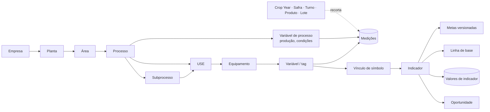
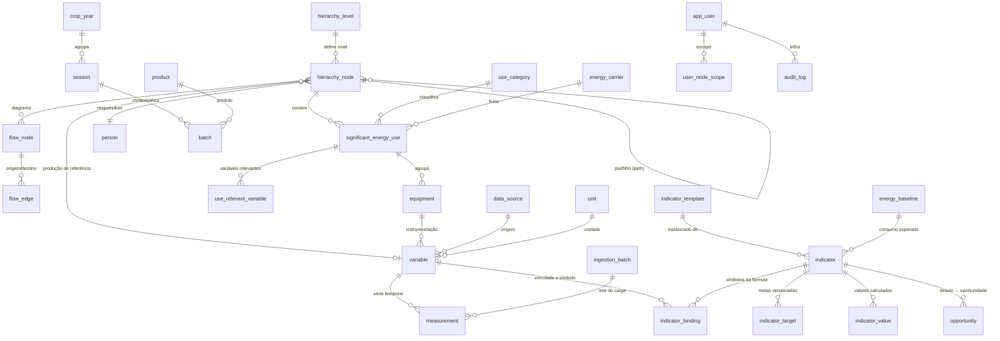
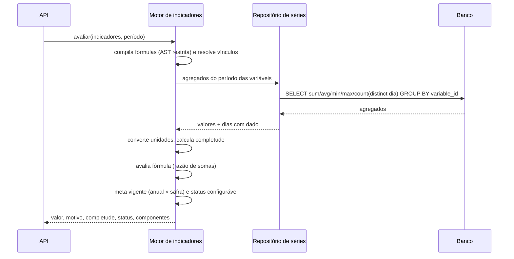

# ETAPA 3 — Arquitetura de dados

## 3.1 Separação em três domínios

| Domínio | O que guarda | Característica |
|---|---|---|
| **Master Data** | hierarquia, USEs, equipamentos, variáveis/tags, indicadores, fórmulas, metas, linhas de base, unidades, responsáveis | baixo volume, alta cardinalidade de relações, versionado e auditado |
| **Time Series** | medições, valores de indicadores materializados, eventos operacionais | alto volume, escrita append-only, leitura por janela de tempo |
| **Contextual** | Crop Year, safra, turno, produto, lote | define o recorte de análise; muda pouco, explica muito |

A separação é lógica (schemas/tabelas distintas) e física em produção: as tabelas temporais viram *hypertables*
particionadas no TimescaleDB, com compressão e agregados contínuos; o master data segue relacional puro.

## 3.2 Modelo conceitual



## 3.3 Modelo relacional (ERD)



### Tabelas principais (resumo dos campos que sustentam a metodologia)

**`hierarchy_node`** — `code`, `name`, `level` (FK para `hierarchy_level`: empresa/planta/área/processo/subprocesso,
cadastráveis), `parent_id`, `path` materializado (`/1/2/5/`, permite consultar subárvore com um `LIKE`; em
produção pode virar `ltree`), `sort_order`, `owner_id`, `color_slot`, `production_variable_id` (a variável que
normaliza a intensidade daquele nó), `operating_regime`, `attributes` (JSONB).

**`significant_energy_use`** — `category_id`, `node_id`, `energy_carrier_id`, `operating_regime`
(contínuo/intermitente/batelada/sazonal), `operating_period`, `significance_reason`, `responsible_id`.

**`equipment`** — dados de placa que alimentam os indicadores intrínsecos: `rated_power_kw`,
`rated_efficiency_pct`, `efficiency_class`, `has_vfd`, `commissioning_year` e `attributes` (JSONB para
tensão/corrente nominal, capacidade da caldeira, vazão do compressor…).

**`variable`** — `code`, `variable_type` (energy, energy_state, production, operational, electrical,
process_condition, context), `unit_id`, `node_id`, `equipment_id`, `energy_carrier_id`, `data_source_id`,
`source_tag` (tag no historiador), `collection_frequency`, `is_automatic`, `measurement_method`
(medido/estimado/calculado), `aggregation` (sum/avg/min/max/last), `counts_toward_total` (evita dupla contagem
entre medidor geral e submedições).

**`indicator`** — `formula` (texto), `unit_id`, `kind` (intrínseco/extrínseco), `category`, escopo
(`node_id`/`use_id`/`equipment_id`), `direction`, `decimals`, `status_rule` (JSONB: base, tolerância, crítico),
`upper_limit`/`lower_limit`, `min_completeness_pct`, `operating_variable_id`, `stability_band_pct`,
`baseline_model_id`, `responsible_id`.

**`indicator_binding`** — liga cada símbolo da fórmula a: uma **variável** (com agregação e conversão de
unidade), uma **constante**, um **atributo de equipamento** (dado de placa) ou uma **função de período**
(`PERIOD_DAYS`, `PERIOD_HOURS`).

**`indicator_target`** — metas versionadas com `valid_from`/`valid_to`, `scope` (`all`, `annual`, `seasonal`),
`target_value` ou faixa (`target_min`/`target_max`), `baseline_value`, `label` e `justification`.

**`energy_baseline`** — `model_type` (fixa ou regressão), período de ajuste, `energy_variable_id`,
`operating_filter_variable_id` e `model` (JSONB com intercepto, coeficientes, R², CV(RMSE), n e variáveis
relevantes) — base do *consumo esperado* e do CUSUM.

**`measurement`** — `(variable_id, ts)` como chave, `value` (nulo permitido quando a leitura é ruim),
`quality` (good/suspect/bad/estimated/manual), `source`, `batch_id`, `ingested_at`.

**`indicator_value`** — valores materializados por grão (`day`/`week`/`month`) com `completeness_pct`, `status`
e `components` — usado por alarmes, exportação e histórico congelado.

**`opportunity`** — vínculo com nó/USE/equipamento/indicador, problema, ação, economia estimada
(MWh/ano e R$/ano), investimento, prioridade, status, prazo e `deviation_snapshot` (JSONB com o retrato do
desvio que a originou).

**`audit_log`** — quem, quando, o quê, valores antes/depois, IP e id de requisição.

## 3.4 Estrutura das séries temporais

```sql
-- PostgreSQL + TimescaleDB (executado automaticamente quando a extensão existe)
SELECT create_hypertable('measurement', by_range('ts', INTERVAL '30 days'), if_not_exists => TRUE);
ALTER TABLE measurement SET (timescaledb.compress, timescaledb.compress_segmentby = 'variable_id');
SELECT add_compression_policy('measurement', INTERVAL '90 days');

CREATE MATERIALIZED VIEW measurement_daily
WITH (timescaledb.continuous) AS
SELECT variable_id,
       time_bucket(INTERVAL '1 day', ts) AS day,
       sum(value) v_sum, avg(value) v_avg, min(value) v_min, max(value) v_max,
       last(value, ts) v_last, count(value) n_valid,
       count(*) FILTER (WHERE quality IN ('bad','suspect')) n_bad
FROM measurement GROUP BY 1, 2;
```

O agregado diário é a base de **todos** os cálculos de período; `n_valid` é o que permite medir completude sem
confundir “zero medido” com “sem leitura”. O mesmo contrato é atendido em SQLite (modo demo) por agregação
equivalente — o repositório de séries é a única camada que conhece o dialeto.

### Volume e retenção (estimativa para a planta DEMO)

| Item | Valor |
|---|---|
| Variáveis cadastradas | 279 |
| Granularidade simulada | diária (3 anos) |
| Linhas de medição | ~272 mil |
| Granularidade real esperada | 1–15 min nas tags de energia |
| Projeção com 1 min em 300 tags | ~158 milhões de linhas/ano → com compressão Timescale, dezenas de GB |
| Política sugerida | bruto 90 dias sem compressão, 2 anos comprimido, agregados diários/semanais retidos indefinidamente |

## 3.5 O motor de cálculo sobre esse modelo



Pontos de projeto relevantes:

- **Uma consulta por conjunto de variáveis**, não uma por indicador: avaliar 249 indicadores em um mês custa
  ~25 ms na base DEMO.
- **Cache com versão de dado**: toda ingestão/edição invalida a versão; em produção o cache vai para Redis com
  a mesma chave.
- **Fórmulas são dados** e passam por um avaliador restrito (sem `eval`, sem atributos, sem chamadas
  arbitrárias) — ver `backend/app/engine/formula.py` e os testes de segurança correspondentes.

## 3.6 Contexto: Crop Year e safra

`crop_year` e `season` são entidades com data inicial e final, **sem qualquer vínculo com o ano civil**. A
comparação “safra × safra” busca a safra anterior **do mesmo tipo** (Safrinha 2026 → Safrinha 2025, não a Safra
Verão imediatamente anterior). Metas com escopo `seasonal` usam as janelas de safra; períodos longos usam as
metas anuais. Tudo isso é configurável em tela.

## 3.7 Qualidade e linhagem do dado

Cada variável declara origem (`data_source`), tag de origem, frequência, se é automática e o método
(medido/estimado/calculado). Cada medição carrega qualidade e o lote de ingestão que a trouxe. A partir daí o
sistema calcula, por período: dias com dado × dias esperados, percentual de leituras suspeitas/ruins e última
atualização — exibidos no indicador, na variável e na tela de qualidade de dados.
