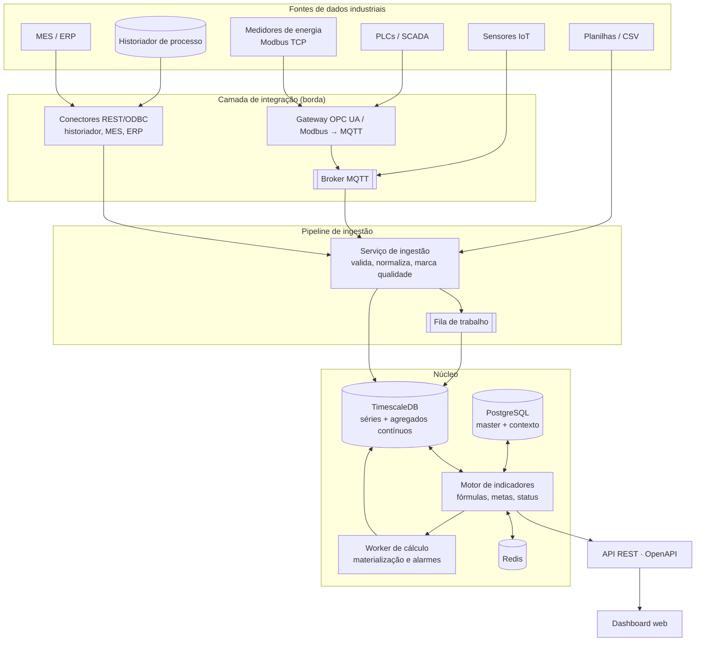
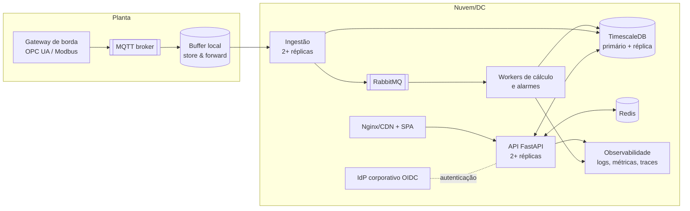

# ETAPA 4 — Arquitetura tecnológica

## 4.1 Visão geral



**Fronteira de responsabilidade**: o front-end nunca fala com sistemas industriais. Ele conhece apenas a API. A
camada de integração é a única que toca PLC, historiador, MES/ERP — isolando o dashboard de mudanças de chão de
fábrica e mantendo a superfície de ataque restrita.

## 4.2 Escolhas, justificativas e alternativas

### Front-end — React 19 + TypeScript + Vite

- **Por quê**: o produto é uma aplicação interna atrás de login, com muita interação (fluxograma, drill-down,
  filtros na URL) e nenhuma necessidade de SEO. Vite entrega build simples e rápido; TypeScript protege os
  contratos da API, que são numerosos.
- **Vantagens**: ecossistema maduro (React Flow, ECharts, TanStack Query), equipe encontra profissionais com
  facilidade, deploy é um bundle estático servido por Nginx/CDN.
- **Desvantagens**: SPA exige atenção com tamanho de bundle e estado; sem SSR, a primeira carga é maior.
- **Alternativas**: *Next.js* (SSR/rotas de servidor — traz servidor Node para manter, sem benefício aqui;
  seria a escolha se houvesse páginas públicas ou BFF pesado); *Vue/Angular* (equivalentes; Angular favorece
  times grandes com padrão rígido); *Power BI/Grafana* (rápidos para gráficos, mas não modelam USE →
  equipamento → indicador nem o fluxograma clicável — foi exatamente o que se quis evitar).

**Bibliotecas**: React Flow (`@xyflow/react`) para o fluxograma — é a única madura para grafo interativo com
nós customizados; ECharts (canvas) para gráficos, por desempenho com séries longas e por trazer Sankey,
heatmap e carta de controle sem plugins; TanStack Query para cache/refetch; Tailwind v4 + Radix para UI
acessível sem framework visual pesado. *D3* foi descartado como base (custo de manutenção alto para o mesmo
resultado); *Plotly* é excelente, mas o bundle é maior e o estilo é mais difícil de alinhar ao design system.

### Back-end — Python 3.12 + FastAPI

- **Por quê**: o coração do sistema é cálculo sobre séries (agregação, regressão, controle estatístico, LMDI).
  Python tem numpy/pandas/scikit-learn/statsmodels no mesmo processo, o que encurta o caminho da evolução
  (baselines, previsão, detecção de anomalia). FastAPI gera OpenAPI automaticamente e valida entrada com
  Pydantic.
- **Vantagens**: produtividade alta, tipagem em runtime, documentação viva em `/docs`, mesma linguagem do time
  de dados/engenharia.
- **Desvantagens**: menor throughput bruto por processo que Node/Go; exige cuidado com I/O bloqueante (usar
  workers e evitar chamadas síncronas longas no request).
- **Alternativas**: *Node.js + NestJS* (bom se o time for majoritariamente JS e o backend for CRUD; perde o
  ecossistema científico, e o motor de indicadores precisaria de um serviço Python de qualquer forma); *Java
  Spring* (robusto, mais cerimônia); *Go* (performance, ecossistema analítico fraco).

### Banco — PostgreSQL + TimescaleDB

- **Por quê**: o domínio é relacional (hierarquia, vínculos, metas) **e** temporal (medições). Timescale é uma
  extensão do PostgreSQL: um único banco, um único backup, SQL padrão, com particionamento, compressão e
  agregados contínuos para séries.
- **Vantagens**: junta master data e séries sem ETL entre bancos; compressão de 10–20× em telemetria;
  `time_bucket` e `last()` simplificam o repositório.
- **Desvantagens**: menos “infinito” que um TSDB dedicado em escalas de bilhões de pontos/dia; requer extensão
  no serviço gerenciado (Azure/AWS oferecem, ou usa-se container próprio).
- **Alternativas**: *InfluxDB/QuestDB* (ótimos para séries, mas obrigam a um segundo banco relacional e a junções
  na aplicação); *ClickHouse* (excelente para analytics massivo, custo operacional maior); *PostgreSQL puro com
  partições* (funciona; perde compressão e agregados contínuos prontos).
- **Modo demo**: SQLite, para rodar em qualquer máquina sem infraestrutura. O código usa SQLAlchemy 2 e um
  repositório de séries isolado, então a troca é só de `DATABASE_URL`.

### Cache — Redis (produção)

Consultas de dashboard repetem o mesmo recorte para vários usuários. O motor já usa cache em memória com
*versão de dado* (invalidada por ingestão/edição); em produção o mesmo contrato aponta para Redis, permitindo
compartilhar cache entre réplicas da API e servir de backend para filas leves.

### APIs — REST com OpenAPI

- **Por quê**: o consumo é previsível e orientado a recursos e períodos; REST com documentação automática é
  mais simples de versionar, cachear (HTTP) e integrar com outros sistemas corporativos.
- **GraphQL** foi considerado: resolveria *over-fetching* em telas que combinam muitos recursos, mas traz custo
  de cache, autorização por campo e ferramental. O problema real (telas que precisam de vários recortes) foi
  resolvido com **endpoints de composição** (`/dashboard/overview`, `/compare`, `/nodes/{id}/summary`), que
  entregam exatamente o que a tela precisa em uma chamada.
- Para tempo real futuro: **SSE** para notificação de novos valores/alarmes (mais simples que WebSocket e
  suficiente para *push* unidirecional); WebSocket apenas se houver interação bidirecional.

### Comunicação entre serviços

| Necessidade | Escolha | Por quê |
|---|---|---|
| Telemetria de campo → nuvem/servidor | **MQTT** (via gateway OPC UA/Modbus) | leve, tolerante a rede instável, padrão industrial |
| Leitura de historiador/MES/ERP | **REST/ODBC agendado** | sistemas corporativos expõem APIs ou views; agendamento evita acoplamento |
| Ingestão → cálculo | **Fila** (RabbitMQ no MVP; Kafka só se o volume/retenção justificar) | desacopla picos de ingestão do cálculo |
| API ↔ front-end | **REST/JSON + SSE** | simples, cacheável, documentado |
| Cálculos pesados | **Worker assíncrono** (Celery/RQ/Arq) | materialização de indicadores, refit de baselines, alarmes |

Kafka **não** entra no MVP: uma planta com centenas de tags a 1 minuto gera volume que RabbitMQ (ou mesmo
ingestão direta) atende com folga; Kafka se justifica com múltiplas plantas, reprocessamento histórico e
múltiplos consumidores.

## 4.3 Arquitetura recomendada para o MVP

```
[Gateway de borda (OPC UA/Modbus → MQTT)]  →  [Serviço de ingestão + CSV/API]
                                                        ↓
                        [PostgreSQL + TimescaleDB]  ←→  [API FastAPI + motor de cálculo]
                                                        ↓
                                        [SPA React servida por Nginx]
```

- Um único servidor (VM ou container host) com três containers: `db`, `api`, `web`.
- Sem fila: ingestão grava direto; cálculo sob demanda com cache.
- Autenticação local (perfis) ou já integrada ao IdP, conforme a política da planta.
- Backup: dump diário do PostgreSQL + retenção de 30 dias.

## 4.4 Arquitetura recomendada para produção/escala



Elementos que mudam em relação ao MVP: réplicas com balanceador, fila entre ingestão e cálculo,
materialização de `indicator_value` pelo worker, réplica de leitura do banco para relatórios pesados, Redis
compartilhado, autenticação delegada ao IdP (OIDC) e observabilidade (OpenTelemetry).

## 4.5 Integração industrial — como cada fonte entra

| Fonte | Caminho | Observações |
|---|---|---|
| PLC / SCADA | OPC UA no gateway → MQTT → ingestão | leitura por assinatura; *deadband* configurado no gateway |
| Medidores de energia | Modbus TCP no gateway → MQTT | um `variable.source_tag` por registrador |
| Historiador (PI, Aveva, Canary) | conector REST/SDK agendado | recomendado para histórico e reprocesso |
| MES | REST (produção, lotes, turnos) | alimenta as variáveis de produção e o contexto |
| ERP | REST/arquivo (ordens, custos, tarifas) | para converter economia em R$ |
| Planilhas/laboratório | upload CSV com validação | umidade, análises manuais; qualidade marcada como `manual` |
| Data lake / DW corporativo | exportação agendada dos agregados | o dashboard não depende dele para operar |

Regras de ingestão implementadas: validação de tag, timestamp e valor; **valor vazio só é aceito com
`quality=bad/suspect`** (ausência nunca vira zero); relatório por linha rejeitada; rastreabilidade por lote de
ingestão; autenticação por chave de integração para máquina-a-máquina.

## 4.6 Segurança

| Camada | MVP | Produção |
|---|---|---|
| Autenticação | JWT emitido pela API (PBKDF2-SHA256, 200k iterações) | OIDC com o IdP corporativo (ex.: Entra ID); API valida JWT por JWKS |
| Autorização | 4 perfis (Administrador, Gestão de Energia, Dono do Processo, Visualizador) | mesmos perfis mapeados a grupos do IdP |
| Segregação | escopo por nó da hierarquia para dono de processo | idem, com herança por subárvore |
| APIs | CORS restrito, validação Pydantic, rate limit no proxy | + mTLS na ingestão, WAF, cotas por cliente |
| Segredos | variáveis de ambiente | cofre (Key Vault/Secrets Manager), rotação automática |
| Auditoria | trilha com antes/depois, usuário, IP, request-id | + retenção longa e exportação para SIEM |
| Dados | dados DEMO fictícios | classificação de dados, backup cifrado, LGPD nos dados de pessoas |

## 4.7 Infraestrutura e entrega

- **Contêineres** para os três serviços; `docker-compose` no MVP, Kubernetes/ACA/ECS quando houver réplicas.
- **Migrações** de schema versionadas (Alembic) antes de subir a API.
- **Pipeline**: lint + testes de back-end (pytest) + typecheck/build do front + imagem publicada; ambientes
  dev → homologação → produção.
- **Observabilidade**: logs estruturados, métricas de latência por endpoint (a API já devolve
  `X-Response-Time-ms`), *health check* em `/health` e alertas de atraso de ingestão por variável.
- **Desempenho medido na base DEMO** (SQLite, máquina local): avaliação de 249 indicadores em um mês ≈ 25 ms;
  dashboard completo ≈ 210 ms; comparação de Crop Year (365 dias × 2) ≈ 950 ms. Em produção, os agregados
  contínuos do Timescale e o Redis reduzem os casos longos.

## 4.8 Riscos técnicos e mitigação

| Risco | Mitigação |
|---|---|
| Tags do historiador mudam de nome | `variable.source_tag` desacoplado do código da variável; ingestão aceita tag ou código e reporta rejeição |
| Medição incompleta gera decisão errada | completude explícita, status *Sem dados suficientes* e tela de qualidade |
| Dupla contagem de energia | `counts_toward_total` + regra de energia secundária + “não alocado” visível |
| Crescimento das séries | hypertable + compressão + agregados contínuos + política de retenção |
| Fórmulas malformadas por usuário | validação sintática, símbolos obrigatórios, pré-visualização antes de salvar |
| Dependência de uma pessoa para cadastrar | tudo é tela + API documentada + trilha de auditoria |
