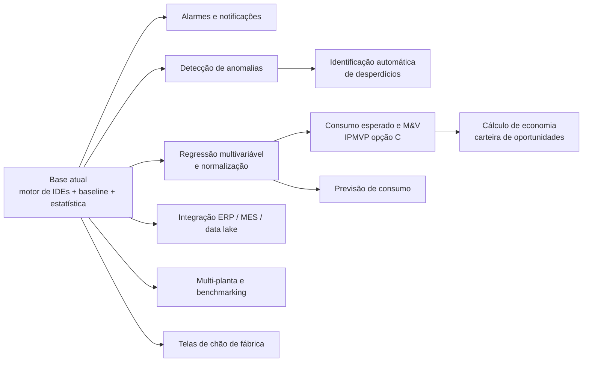

# Evoluções futuras — roadmap técnico

> Leitura honesta do que **já está preparado** na arquitetura atual e do que ainda **exige trabalho**.
> A ISO 50001 é referencial metodológico (não há objetivo de certificação). Os dados do ambiente atual
> são **DEMO/fictícios**; toda estimativa de esforço pressupõe a substituição por dados reais.
> Escala de esforço: **P** ≈ até 2 semanas · **M** ≈ 3 a 6 semanas · **G** ≈ acima de 6 semanas (uma pessoa
> dedicada, sem contar negociação de acesso a fontes de dado).

---

## 1. Panorama

### 1.1 O que já está construído e serve de alicerce

| Peça existente | Onde | Serve de base para |
|---|---|---|
| Carta de controle de valores individuais (I-MR, limites 2,66·MR̄) e regra de sequência de 8 pontos | `backend/app/engine/stats.py` → `control_chart` | Detecção de anomalias e de mudança de patamar |
| Tendência por regressão linear com classificação sensível à direção desejada | `stats.py` → `linear_trend` | Priorização, alarmes de deterioração |
| Regressão linear múltipla com R², R² ajustado, CV(RMSE) e estatísticas t | `stats.py` → `fit_linear_regression` | Linha de base, consumo esperado, normalização |
| Linha de base energética persistida (variáveis relevantes, coeficientes, período, filtro de operação, status draft/active/superseded) | `models/master.py` → `EnergyBaseline`; `services/baselines.py` | M&V, observado × esperado, CUSUM |
| CUSUM de (observado − esperado) e critérios de aceitação (R² ≥ 0,75; CV(RMSE) ≤ 25%) | `services/baselines.py` → `evaluate` | M&V contínuo, verificação de economia |
| Decomposição LMDI (efeito produção × efeito intensidade) | `stats.py` → `lmdi` | Relatórios executivos, metas por fator |
| Tabela de valores materializados de indicador por granularidade | `models/timeseries.py` → `IndicatorValue` | Alarmes, exportação para BI, histórico congelado |
| Ingestão autenticada máquina-a-máquina e por CSV, com lote rastreável e rejeições explicadas | `api/routes_ops.py`; `models/timeseries.py` → `IngestionBatch` | Gateways OPC UA/MQTT, cargas do MES/ERP |
| Hypertables, política de compressão e agregado contínuo diário | `backend/db/timescale/001_hypertables.sql` | Volume de dados reais (minuto a minuto) |
| Cache com versionamento de dado | `engine/repository.py` → `_TTLCache.data_version` | Troca direta por Redis |
| Perfis, escopo por nó e trilha de auditoria | `security.py`; `models/ops.py` → `AuditLog` | Governança em produção |

### 1.2 O que **não** existe hoje (para não haver ilusão)

- Não há *worker* assíncrono: todo cálculo acontece sob demanda, na requisição.
- Não há fila de mensagens, agendador (cron/Celery/RQ), nem serviço de notificação.
- `IndicatorValue` existe como tabela, mas nada a alimenta ainda.
- Não há modelo preditivo, nem detecção automática de anomalia rodando em background.
- Não há coletor real: os dados vêm do gerador de simulação (`app/seed/`).

---

## 2. Itens do roadmap

### 2.1 Detecção automática de anomalias

| Item | Conteúdo |
|---|---|
| **Valor esperado** | Sair da inspeção manual: o sistema aponta o desvio no dia em que ele aparece, não no fechamento do mês. Reduz o tempo entre o evento (damper travado, filtro colmatado, vazamento) e a ação. |
| **Já preparado** | A estatística está pronta e validada: limites I-MR, pontos fora de controle, regra de sequência de 8 pontos e classificação de tendência já são calculados e exibidos no histórico de cada indicador. |
| **Falta** | Executar essa análise **para todos os indicadores, todo dia, em background** e persistir o resultado como evento; definir supressão de ruído (não realertar o mesmo desvio); janela de referência configurável (período de baseline em vez da janela exibida); tratamento de sazonalidade forte (safra × entressafra). |
| **Pré-requisitos de dado** | ≥ 20 pontos válidos por indicador na granularidade escolhida; completude mínima já configurada por IDE; marcação confiável de dias sem operação. |
| **Componentes afetados** | Novo worker + agendador; nova tabela `anomaly_event`; `engine/stats.py` (parametrizar a janela de referência); UI: página de alertas e marcação no histórico. |
| **Esforço** | **M** |

### 2.2 Alarmes e notificações

| Item | Conteúdo |
|---|---|
| **Valor esperado** | O desvio chega a quem pode agir (dono do processo) sem depender de alguém abrir o dashboard. |
| **Já preparado** | Responsável cadastrado por indicador, USE e nó; regra de status configurável por IDE; e-mail das pessoas no cadastro. |
| **Falta** | Fila (RabbitMQ para começar; Kafka só se o volume justificar), worker consumidor, regras de disparo (status, tendência, anomalia, falha de coleta), política anti-spam (agrupamento diário, silêncio durante entressafra), canais (e-mail corporativo, Teams, webhook) e registro de envio. |
| **Pré-requisitos de dado** | Cálculo diário materializado (§2.9) e e-mails/identidades corporativas válidos. |
| **Componentes afetados** | Infra (broker + worker); `models` (`alert_rule`, `alert_event`); API de preferências; UI de configuração de alarmes. |
| **Esforço** | **M** |

### 2.3 Regressões energéticas multivariáveis e normalização

| Item | Conteúdo |
|---|---|
| **Valor esperado** | Julgar desempenho descontando o que não está sob controle da operação: volume, umidade do grão, temperatura ambiente, mix de produto. É o que separa "gastou mais" de "gastou pior". |
| **Já preparado** | A regressão múltipla já roda e é usada na planta DEMO (secador ~ água evaporada; caldeira ~ vapor; despalha ~ toneladas; ar comprimido ~ sacos + limpeza). Variáveis relevantes já são cadastráveis por USE, com justificativa. |
| **Falta** | Seleção assistida de variáveis (correlação, VIF, significância dos coeficientes já disponíveis mas não expostos); termos não lineares e de interação; validação cruzada; detecção de mudança estrutural que obrigue a refazer a baseline; ajuste estático/não rotineiro documentado (troca de equipamento, mudança de produto). |
| **Pré-requisitos de dado** | Variáveis relevantes medidas com a mesma granularidade da energia e ≥ 12 meses cobrindo a faixa operacional; registro de eventos que expliquem quebras. |
| **Componentes afetados** | `services/baselines.py`; UI de linhas de base (assistente de ajuste); documentação metodológica. |
| **Esforço** | **M** |

### 2.4 Consumo esperado e M&V (IPMVP opção C)

| Item | Conteúdo |
|---|---|
| **Valor esperado** | Provar a economia de cada ação com método reconhecido, em vez de comparar dois meses quaisquer. Fecha o ciclo oportunidade → implementação → verificação. |
| **Já preparado** | Observado × esperado, diferença acumulada (CUSUM), economia no período e critérios de aceitação do modelo já são calculados e exibidos na aba "Observado × esperado" do indicador. A oportunidade já guarda o **retrato do desvio** que a originou e tem os estados `implementada` e `verificada`. |
| **Falta** | Amarrar formalmente baseline ↔ período de relatório ↔ ação: data de implementação, período de verificação, economia evitada acumulada e incerteza (intervalo de confiança). Relatório de M&V exportável. Ajustes não rotineiros versionados. |
| **Pré-requisitos de dado** | Baseline aprovada e congelada antes da ação; data exata da intervenção (já modelada em `OperationalEvent`); continuidade da medição no pós-período. |
| **Componentes afetados** | `models` (vínculo oportunidade ↔ baseline ↔ período); `services/baselines.py` (incerteza); UI da oportunidade (aba de verificação); geração de PDF/planilha. |
| **Esforço** | **M** |

### 2.5 Identificação automática de desperdícios

| Item | Conteúdo |
|---|---|
| **Valor esperado** | Converter padrões conhecidos em achados automáticos: consumo fora de janela produtiva, tempo em vazio acima do habitual, equipamento ligado em dia sem produção, pressão de ar acima do necessário, excesso de ar na combustão, partidas em excesso. |
| **Já preparado** | Os indicadores que revelam esses padrões **já existem** e são calculados (consumo sem produção, tempo em vazio, partidas/dia, pressão média, O₂ nos gases); o diagnóstico por etapa já agrega desvios, deteriorações e problemas de dado. |
| **Falta** | Uma camada de **regras nomeadas** ("compressor ligado em domingo sem ensaque") que combine indicador + contexto + limiar e gere um achado com economia estimada e sugestão de ação — hoje o diagnóstico é genérico, baseado em status e variação. |
| **Pré-requisitos de dado** | Calendário produtivo confiável (turnos, paradas planejadas) e estados operacionais por equipamento. |
| **Componentes afetados** | Novo `services/waste_rules.py` + tabela de regras; UI: diagnóstico com tipo do achado e ação sugerida; integração com a criação de oportunidade (já pré-preenchida). |
| **Esforço** | **M** |

### 2.6 Cálculo de economia e priorização da carteira

| Item | Conteúdo |
|---|---|
| **Valor esperado** | Decidir por retorno, não por percepção: economia (MWh/ano e R$/ano), investimento, payback e risco, com rastreabilidade até o indicador. |
| **Já preparado** | A oportunidade já carrega economia estimada em MWh/ano e R$/ano, investimento, prioridade, prazo, responsável e o retrato do desvio; a carteira já mostra payback simples e Pareto do potencial por etapa. |
| **Falta** | Tarifa de energia versionada (ponta/fora de ponta, demanda contratada, preço da biomassa) em vez de valor digitado; cálculo assistido da economia a partir do próprio indicador (ex.: reduzir tempo em vazio de 22% para 8% equivale a X MWh/ano); consolidação anual da carteira contra a meta corporativa. |
| **Pré-requisitos de dado** | Estrutura tarifária e preço de combustível por período; horas de operação projetadas. |
| **Componentes afetados** | `models` (`energy_tariff`); serviço de cálculo; UI da oportunidade e do dashboard executivo. |
| **Esforço** | **P/M** |

### 2.7 Previsão de consumo

| Item | Conteúdo |
|---|---|
| **Valor esperado** | Antecipar demanda para contratação de energia, programação da caldeira e compra de biomassa; e comparar realizado × previsto durante a safra. |
| **Já preparado** | Pouco além da base de séries: a estrutura de séries temporais, o motor de agregação e o modelo de regressão dão o ponto de partida. |
| **Falta** | Praticamente tudo: escolha do horizonte (semanal para operação, mensal para contratação), modelo (regressão com drivers de produção planejada é mais defensável que série temporal pura, dada a sazonalidade de safra), *backtesting*, métricas de erro (MAPE/WAPE) e exibição de incerteza. |
| **Pré-requisitos de dado** | **Plano de produção** (o driver principal) — hoje inexistente no modelo; ≥ 2 safras completas de histórico real; clima, se entrar como variável. |
| **Componentes afetados** | Novo módulo de previsão + worker; tabela de previsões; UI (realizado × previsto). Sem plano de produção integrado, não vale começar. |
| **Esforço** | **G** |

### 2.8 Inteligência artificial — onde faz sentido e onde não

**Faz sentido (com benefício técnico claro):**

| Aplicação | Por quê |
|---|---|
| Detecção multivariada de anomalia (ex.: *isolation forest* sobre energia + produção + umidade + horas) | Capta combinações que nenhuma regra univariada pega; complementa — não substitui — a carta de controle. |
| Imputação **sinalizada** de falhas curtas de comunicação | Recupera análises inviabilizadas por 2–3 horas sem leitura, desde que o valor fique marcado como estimado e a completude continue refletindo a realidade. |
| Agrupamento de perfis operacionais (dias típicos) | Ajuda a definir regimes e comparar "dia igual com dia igual" na sazonalidade de safra. |
| Explicação em linguagem natural dos achados já calculados | Acelera a leitura do diagnóstico pelo dono do processo — o cálculo continua determinístico e auditável. |

**Não faz sentido (IA decorativa, a evitar):**

- Substituir a regressão da linha de base por modelo de caixa-preta: perde-se a defensabilidade exigida em
  M&V, e o ganho de ajuste é irrelevante para a decisão.
- "Chat que responde qualquer coisa sobre energia" sem ancoragem nos indicadores: risco de resposta
  inventada em um domínio onde o número precisa ser rastreável até a tag.
- Previsão com séries curtas (menos de duas safras): ruído apresentado como certeza.
- Classificação automática de causa raiz sem dados de manutenção e de processo: o sistema passaria a
  afirmar causas que não pode observar.

**Regra geral**: nenhum resultado de IA substitui um número calculado por fórmula cadastrada; ele entra
como *sugestão marcada como tal*, sempre com o caminho para o dado bruto. **Esforço**: **M** (anomalia
multivariada) a **G** (demais).

### 2.9 Materialização e desempenho

| Item | Conteúdo |
|---|---|
| **Valor esperado** | Resposta estável quando houver 100× mais dados (medição minuto a minuto, anos de histórico, mais plantas). |
| **Já preparado** | Hypertables + compressão + agregado contínuo diário no TimescaleDB; cache com versionamento; agregação empurrada para o banco; tabela `IndicatorValue` modelada. |
| **Falta** | Worker que calcula e grava `IndicatorValue` na ingestão (diário/semanal/mensal); leitura dos endpoints de listagem a partir dessa tabela; Redis no lugar do cache em memória (obrigatório com múltiplas réplicas da API). |
| **Componentes afetados** | Worker + agendador; `engine/indicators.py` (caminho de leitura materializada); infra (Redis). |
| **Esforço** | **M** |

### 2.10 Integração com ERP, MES e data lake

| Item | Conteúdo |
|---|---|
| **Valor esperado** | Eliminar digitação e planilha: produção, lotes, produto, paradas e custo vindos da fonte oficial. |
| **Já preparado** | Camada de integração desenhada e endpoint de ingestão autenticado por chave, com lote rastreável e rejeição explicada; modelo de contexto (Crop Year, safra, turno, produto, lote) já existe; nada no front-end fala com sistema industrial. |
| **Falta** | Conectores por fonte: gateway OPC UA/MQTT → API (borda), consulta ao historiador, API do MES para apontamento, ERP para custo e tarifa, e publicação para o data lake corporativo. Mapeamento tag ↔ variável versionado e reconciliação (reprocessamento de dado corrigido). |
| **Pré-requisitos** | Acesso liberado, catálogo de tags e política de rede/segurança (o front-end nunca conversa direto com o chão de fábrica). |
| **Componentes afetados** | Serviços de integração; `models` (mapa de tags, janela de reprocessamento); operação (monitoramento de coleta). |
| **Esforço** | **M** por conector; **G** no total. |

### 2.11 Chão de fábrica e mobilidade

| Item | Conteúdo |
|---|---|
| **Valor esperado** | Levar o indicador para onde a decisão acontece: painel de parede por área e consulta rápida em tablet durante a ronda. |
| **Já preparado** | Interface responsiva até tablet; tema escuro pronto para painel; rotas por área e por etapa; gráficos redesenham por `ResizeObserver`. |
| **Falta** | Modo quiosque (sem sidebar, rotação automática entre áreas, atualização periódica, fonte ampliada); leitura de apontamento manual em campo (umidade, paradas); uso offline. |
| **Pré-requisitos** | Telas e rede na planta; definição do que cada turno precisa ver. |
| **Componentes afetados** | Nova rota de quiosque reaproveitando os componentes existentes; PWA se houver necessidade offline. |
| **Esforço** | **P** (quiosque) · **M** (apontamento em campo). |

### 2.12 Multi-planta e benchmarking

| Item | Conteúdo |
|---|---|
| **Valor esperado** | Comparar unidades com a mesma metodologia e transformar a melhor prática de uma planta em meta para as demais. |
| **Já preparado** | A hierarquia já é uma árvore genérica com empresa → planta → área → processo → subprocesso; USEs, indicadores e metas são cadastráveis por planta; o motor não conhece nomes de planta. |
| **Falta** | Isolamento por planta na autorização (hoje o escopo é por nó, o que já cobre o essencial, mas falta o filtro de planta no topo); normalização entre unidades (mix de produto, clima, porte) para que a comparação seja justa; catálogo corporativo de indicadores padronizados; consolidação executiva multi-planta. |
| **Pré-requisitos** | Mesma definição de IDE entre plantas — sem isso, benchmark vira ranking enganoso. |
| **Componentes afetados** | Seletor de planta na barra global; serviço de consolidação; governança de catálogo. |
| **Esforço** | **M** |

---

## 3. Sequência sugerida

| Onda | Itens | Racional |
|---|---|---|
| **1 — Confiabilidade** | Materialização e worker (§2.9) · conector do historiador e do MES (§2.10) | Sem dado real e cálculo materializado, todo o resto é demonstração. |
| **2 — Ação** | Alarmes (§2.2) · detecção de anomalias (§2.1) · regras de desperdício (§2.5) | Transformam o dashboard de relatório em ferramenta de rotina. |
| **3 — Prova** | Normalização multivariável (§2.3) · M&V (§2.4) · economia e tarifa (§2.6) | Permite defender resultado e priorizar investimento com método. |
| **4 — Escala** | Multi-planta (§2.12) · quiosque (§2.11) · previsão (§2.7) · IA aplicada (§2.8) | Só faz sentido depois que uma planta estiver rodando com dado real e rotina estabelecida. |
